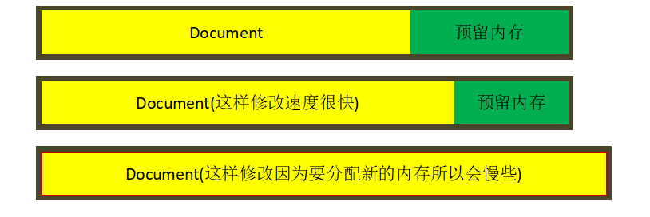
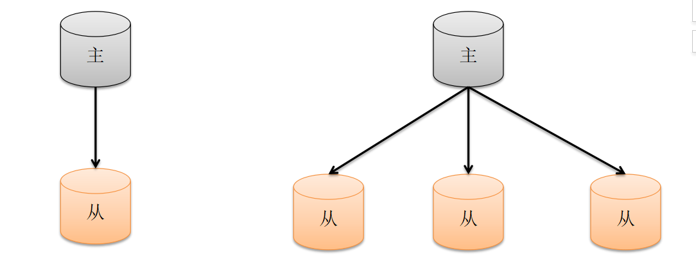

# 学习MongoDB

 **练习环境**
 
    MongoDB v3.6.2

[TOC]

## 简介：

    MongoDB  是一个基于分布式文件存储的数据库。由C++语言编写。旨在为WEB应用提供可扩展的高性能数据存储解决方案。
    MongoDB 是一个介于关系数据库和非关系数据库之间的产品，是非关系数据库当中功能最丰富，最像关系数据库的。他支持的数据结构非常松散，是类似json的bson格式，因此可以存储比较复杂的数据类型。Mongo最大的特点是他支持的查询语言非常强大，其语法有点类似于面向对象的查询语言，几乎可以实现类似关系数据库单表查询的绝大部分功能，而且还支持对数据建立索引。
*  特点：高性能、易部署、易使用，存储数据非常方便
        
    主要功能特性有：
       
        *面向集合存储，易存储对象类型的数据。
        *模式自由。
        *支持动态查询。
        *支持完全索引，包含内部对象。
        *支持查询。
        *支持复制和故障恢复。
        *使用高效的二进制数据存储，包括大型对象（如视频等）。
        *自动处理碎片，以支持云计算层次的扩展性。
        *支持RUBY，PYTHON，JAVA，C++，PHP，C#等多种语言。
        *文件存储格式为BSON（二进制）（一种JSON的扩展，比JSON数据类型更加丰富）。
        *可通过网络访问。
        *支持ObjectId、日期类型、正则表达式、JS代码、二进制数据等
* MongoDB 注意事项： 
    
        * MongoDB 不支持事务
        * MongoDB 不支持多表连接查询
        * MongoDB 中的键值对是有序的，相同的键值对，不同的顺序，属于不同的文档
        * new Date(); 返回日期对象，属于日期类型，Date()函数返回日期字符串，在Shell中操作日期要使用日期类型， 日期类型是包含时区的
        * _id的值可以是任意类型，默认是ObjectId类型，可以在分片环境中生成唯一的标识符（时间戳（单位：秒）+主机的唯一标示（主机名的hash值）+进程标识符PID+自动增加的计数器）， 通过时间戳可以大概知道ObjectId大概是按时间先后排序的，主机的唯一标示可以用于保证在多台服务器器上不重复，进程ID为了保证同台服务器器上多个不同的进程之间生成不重复 值，最后一部分是一个自增的计数器， 前面三部分是为了保证同一秒在同一台机器上的同一个进程上生成一个唯一的值，最后一部分用于保证在同一秒、同一台机器、同一个进程 在同一秒内（注意是同一秒内）生成唯一值
        * mongodb中有一些特殊的键，它们被称为修改器、操作符等       

```mongo
 以 $ 开头，如 
        $set（更新字段）、
        $unset(删除字段)、 
        $inc(自增或自减)、
        $and、$or、$in、$nin、$nor、$exists（用于判断文档中是否包含某字段）、
        $push(向数组中尾部添加一个元素)、
        $pushAll(将数组中的所有值push)、
        $addToSet（向set集合中添加元素）、
        $pop(删除数组中的头部或尾部元素)， 
        $pull(删除数组中指定的值)、
        $size（根据数组的长度进行筛选）、
        $slice(返回数组中部分元素，如前几个、后几个、中间连续几个元素)、
        $elemMatch(用于匹配数组中的多个条件)、
        $where(自定义筛选条件，效率比较低，需要将bson转为js对象，不能使用索引，可以先使用普通查询过滤掉部分不满足条件的文档，然后再使用where，尽量减少where操作文档的数量过大)
```    
    
1. mongodb 是NOSQL数据库但是他在文档查询上还是很强大的
2. 查询符基本是用到花括号里面的;更新符基本是在外面
3. shell是个彻彻底底的JS引擎,但是一些特殊的操作要靠他的各个驱动包来完成(JAVA,NODE.JS)


## MongoDB 与MySQL对比````````````

对比项|MySQL|Mongodb
-----|-------|-------
开源|是|是
类型|关系型数据库|非关系型数据库(文档型数据库)NoSQL
||
表|二维表table|集合list
表字段|字段field|键key
主外键|PK，FK|无
灵活度扩展性|差|极高
记录record|关系数据的表的record必须保证拥有每一个field|mongodb的每一个documen的key可以不一样
查询|使用SQL|使用内置的find函数，基于BSON的特性查询工具
||
服务器守护进程|mysqld|mongod
客户端工具|mysql|mongo
逻辑备份工具|mysqldump|mongodump
逻辑还原工具|mysql|mongorestore
数据导出工具|mysqldump|mongoexport
数据导入工具|source|mongoimport
||
新建用户并授权|grant all on \*.\* to username@'localhost'identified by 'passwd';|db.addUser("user","psw") <br>db.auth("user","psw")
显示库列表|show databases;|show dbs
进去库|use dbname;|use dbname
显示表列表|show tables;|show collections
查询主从状态|show slave status;|rs.status
创建库|create database name;|无需单独创建，直接use进去
删除库|drop database dbname;|首先进去该库，db.dropDatabase()
创建表|create table tname(id int);|无需单独创建，直接插入数据
删除表|drop table tname;|db.tname.drop()
插入记录|insert into tname(id) value(2);|db.tname.insert({id:2})
删除记录|delete from tname where id=2;|db.tname.remove({id:2})
修改/更新记录|update tname set id=3 where id=2;|db.tname.update({id:2},{$set:{id:3}},false,true)
查询所有记录|select * from tname;|db.tname.find()
查询所有列|select id from tname;|db.tname.find({},{id:1})
条件查询|select * from tname where id=2;|db.tname.find({id:2})
条件查询|select * from tname where id < 2;|db.tname.find({id:{$lt:2}})
条件查询|select * from tname where id >=2;|db.tname.find({id:{$gte:2}})
条件查询|select * from tname where id=2 and name='steve';|db.tname.find({id:2,name:'steve'})
条件查询|select * from tname where id=2 or name='steve';|db.tname.find($or:[{id:2}, {name:'steve'}])
条件查询|select * from tname limit 1;|db.tname.findOne()
模糊查询|select * from tname where name like "%ste%";|db.tname.find({name:/ste/})
模糊查询|select * from tname where name like "ste%";|db.tname.find({name:/^ste/})
获取表记录数|select count(id) from tname;|db.tname.count()
获取有条件的记录数|select count(id) from tname where id=2;|db.tname.find({id:2}).count()
查询时去掉重复值|select distinct(last_name) from tname;|db.tname.distinct('last_name')
正排序查询|select *from tname order by id;|db.tname.find().sort({id:1})
逆排序查询|select *from tname order by id desc;|db.tname.find().sort({id:-1})
取存储路径|explain select * from tname where id=3;|db.tname.find({id=3}).explain()
||


    


## windows下载安装
    
* 下载地址：https://www.mongodb.com/download-center
* 设置window的环境变量 ：把mongodb/bin目录路径配置到Path下
* 启动数据库服务
    
   查看可配置项： `mongod --help`
    
    * 方式一： 使用默认的路径，MongoDB安装所在的盘符:/data/db

            MongoDB的数据时存储在磁盘上的，而不是存储在内存中的，所以在启动MongoDB服务时需要指定数据存储的位置， 如果不指定会默认存储在/data/db目录下, 注意在使用默认位置时，需要以管理员身份预先创建好目录

        ```cmd
        C:\Windows\system32>D:
        D:\>mkdir data
        D:\>cd data
        D:\data>mkdir db
        D:\data>cd D:\Java\MongoDB\Server\bin
        D:\Java\MongoDB\Server\bin>mongod
        
        MongoDB starting : pid=9712 port=27017 dbpath=D:\data\db\ 64-bit host=zm-PC
        ```
    
    * 方式二： 显式指定数据库路径      

            此种方式也要预先创建好目录，这里的位置放置MongoDB里面，如D:\Java\MongoDB\DB，放在MongoDB里面不需要管理员身份创建 
            根据自己需要修改mongodb.bat文件中的配置

        ```cmd
        mongod --dbpath D:\soft\MongoDB\data\db
        ```    
    * 方式三： 安装服务
 
        ```cmd
        D:\soft\MongoDB\bin>mongod  --dbpath=D:\data\db --logappend --logpath=D:\data\log.txt --install
        ```
        以后启动服务只需要net start MongoDB, 比mongod --dbpath=xxx 稍微方便些, 以后电脑开机后就自动启动了，省的每次都要启动        
    * 方式四：
        
        mongod.exe --config doc/mongodb.conf


 * mongo 用于客户端连接服务器  
     
     语法： mongo [IP:PORT][/DATABASE_NAME]
     
     IP默认的是127.0.0.1 
     Port默认的是27017 
     database默认的是test，mongodb中默认有两个数据库admin、local    

    ```cmd
    // 连接时不指定要连接数据库，需要时从连接中获取需要的数据库
    D:\soft\MongoDB\bin>mongo --nodb
    MongoDB shell version v3.4.6
    > db
    2017-07-27T20:27:25.181+0800 E QUERY    [thread1] ReferenceError: db is not defined :
    @(shell):1:1
    > conn = new Mongo("localhost:27017")
    connection to localhost:27017
    > db = conn.getDB("test")
    test
    >
    ```
* 停止mongoDB服务
    
    * ctrl+c 组合键可以关闭数据库
    * admin数据库命令关闭数据 
    ```cmd
    use admin
    db.shutdownServer()
    ```
    
    
## shell 基本操作
### 数据库操作
* 创建一个数据库
    
    `use [databaseName]`
    
    注：此时数据库并没有被真正的创建
    
* 查看所有数据库
    
    `show dbs`
* 查看当前数据库 

    `db`    
* 删除当前数据库

    `db.dropDatabase()`   

### 集合操作
#### 创建集合(文档)
  * 方式一：隐式创建集合
            
            当向集合中的插入文档时，如果集合不存在，系统会自动创建，所以向一个不存在的集合中插入数据也就是创建了集合
        
        ```cmd
        > db
        test
        > show tables
        > db.users.insert({"usernmae": "mengdee", "age": 26})
        WriteResult({ "nInserted" : 1 })
        > show tables
        users
        >
        ```
  * 方式二：显示创建集合 
            
            db.createCollection(“集合名字”， 可选配置) 
            
            显示创建集合可以通过一些配置创建一些特殊的集合，如固定集合
      ```cmd
      > show tables
      users
      > db.createCollection("address")
      { "ok" : 1 }
      
      // 固定集合只能通过调用方法显式创建，固定集合可以指定集合存储数据的大小和最多允许存储的条数
      // 当固定集合文档条数达到上限时，再插入新的文档会将最老的文档删除掉，然后插入到该位置
      > db.createCollection("address", {capped: true, size: 10000, max:1000})
      { "ok" : 1 }
      > show tables
      address
      users
      >
      ```
#### 删除集合

    db.集合名字.drop()
```cmd
> db.address.drop()
true
```
#### 查看集合

    `show tables`和`show collections`都可以查看当前数据下的集合
     
#### 添加数据(记录)
* 方式一： insert： _id 会自动创建唯一索引，当id重复的时候会报错
       
        db.[documentName].insert({})        // 插入一条，返回值中不包含insertedIds
        db.[documentName].insert([{}, {}])  // 批量插入，返回值中不包含insertedIds
        db.[documentName].insertOne(Bson)   // 插入一条，返回值返回插入的insertedId
        db.[documentName].insertMany(Bson)  // 批量插入，返回值中包含insertedIds
        db.[documentName].findAndModify({查询条件}, "update": {需要添加或更新的字段},  "upsert": true });

    * 写入安全：
         * 应答模式：插入时会返回成功或者失败
         * 非应答模式：插入时没有反馈，即插入有没有成功不知道
         
    ```cmd
    > var user = {"name": "mengdee", "age": 20, "address": "上海市浦东新区张江镇", "create_time": new Da
    te()}
    > db.users.insert(user)
    WriteResult({ "nInserted" : 1 })
    > db.users.find()
    { "_id" : ObjectId("5976ad21670af2aa52ea90df"), "username" : "mengdee", "age" : 26 }
    { "_id" : ObjectId("5976b395670af2aa52ea90e0"), "name" : "mengdee", "age" : 20, "address" : "上海市
    浦东新区张江镇", "create_time" : ISODate("2017-07-25T02:57:04.545Z") }
    
    > var userDoc = db.users.findOne()
    > var insertDate = userDoc["_id"]
    > insertDate.getTimestamp()
    ISODate("2017-07-25T02:29:53Z")
    > insertDate.str
    5976ad21670af2aa52ea90df
    
    > db.users.insertOne({"username": "mengday3"})
    {
            "acknowledged" : true,
            "insertedId" : ObjectId("5976b632670af2aa52ea90e1")
    }
    > db.users.insertMany([{"username": "mengday4"}, {"username": "mengday5"}])
    {
            "acknowledged" : true,
            "insertedIds" : [
                    ObjectId("5976b666670af2aa52ea90e2"),
                    ObjectId("5976b666670af2aa52ea90e3")
            ]
    }
    > db.users.insert([{"username": "mengday6"}, {"username": "mengday7"}])
    BulkWriteResult({
            "writeErrors" : [ ],
            "writeConcernErrors" : [ ],
            "nInserted" : 2,
            "nUpserted" : 0,
            "nMatched" : 0,
            "nModified" : 0,
            "nRemoved" : 0,
            "upserted" : [ ]
    })
    
    // 使用insertOne插入重复的_id 会报错
    > db.users.insertOne({"_id": 1, "username": "mengday8"})
    { "acknowledged" : true, "insertedId" : 1 }
    > db.users.insertOne({"_id": 1, "username": "mengday8"})
    2017-07-25T11:15:47.822+0800 E QUERY    [thread1] WriteError: E11000 duplicate key error collection:
     test.users index: _id_ dup key: { : 1.0 } :
    WriteError({
            "index" : 0,
            "code" : 11000,
            "errmsg" : "E11000 duplicate key error collection: test.users index: _id_ dup key: { : 1.0 }
    ",
            "op" : {
                    "_id" : 1,
                    "username" : "mengday8"
            }
    })
    
    // findAndModify 也可以用于插入文档，但是前提是一定不存在，如果存在了就变成更新了，单纯的插入还是不要用种方式了，findAndModify一般用于更新或删除操作
    > db.users.findAndModify({ "query": {"username": "mengday11"}, "update": {"username": "mengday11", "age": 26},  "upsert": true })
    null
    > db.users.find()
    { "_id" : ObjectId("597c584448c373e228a9259e"), "username" : "xxx", "age" : 26 }
    ```     
    
    * MongoDB Shell是一种JS，所以可以通过var来定义变量，可以通过find（）方法来查找集合中的所有数据，相当于select * from users 
    * 插入数据时，如果没有指定_id这个字段，系统会自动生成一个值，从该值中能够解析出插入文档的日期或者获取日期中的字符串值
* 方式二：save() 
        
    db.集合名字.save(Bson) : 如果要插入的文档没有指定_id,则插入文档，如果指定_id,如果集合中不包含_id，则插入文档，如果集合中已经存在相同的id值，则更会整体替换
    ```cmd
    > db.user.find()
    > db.user.insert({"_id":1,"username":"mery"})
    WriteResult({ "nInserted" : 1 })
    > db.user.insert({"_id":2,"username":"mery2"})
    WriteResult({ "nInserted" : 1 })
    > db.user.find()
    { "_id" : 1, "username" : "mery" }
    { "_id" : 2, "username" : "mery2" }
    > db.user.save({"_id":3,"age":20})
    WriteResult({ "nMatched" : 0, "nUpserted" : 1, "nModified" : 0, "_id" : 3 })
    > db.user.find()
    { "_id" : 1, "username" : "mery" }
    { "_id" : 2, "username" : "mery2" }
    { "_id" : 3, "age" : 20 }
    > db.user.save({"_id":2,"sex":"nan"})
    WriteResult({ "nMatched" : 1, "nUpserted" : 0, "nModified" : 1 })
    > db.user.find()
    { "_id" : 1, "username" : "mery" }
    { "_id" : 2, "sex" : "nan" }
    { "_id" : 3, "age" : 20 }
    ```
* update() 
    
    `update({查询条件}, {更新的文档}， 是否开启addOrUpdate)` : addOrUpdate为true，当集合中不存在的时候就插入，存在就更新
    ```cmd
    > db.users.find()
    { "_id" : 5, "username" : "mengday10" }
    > db.users.update({"username" : "mengday11"}, { "_id" : 6, "age" : 20, "gender" : 1 }, true)
    WriteResult({ "nMatched" : 0, "nUpserted" : 1, "nModified" : 0, "_id" : 6 })
    > db.users.find()
    { "_id" : 5, "username" : "mengday10" }
    { "_id" : 6, "age" : 20, "gender" : 1 }
    >
    ```
#### 删除 remove
    
    `remove({删除条件})`： 删除满足条件的所有数据 <br>
    `remove({删除条件}， true)`： 删除满足条件的第一条数据  <br>
    `remove({})`: 清空集合中的所有文档
 注:如果想清除一个数据量十分庞大的集合，直接删除该集合并且重新建立索引的办法要比直接用remove的效率高很多。
```cmd
 db.users.find()
{ "_id" : 1, "username" : "mengday", "password" : "123456" }
{ "_id" : 2, "username" : "mengday2", "password" : "123456" }
{ "_id" : 3, "username" : "mengday3", "password" : "123456", "age" : 18 }
{ "_id" : 4, "username" : "mengday4", "password" : "123456", "age" : 28 }
{ "_id" : 5, "username" : "mengday5", "password" : "123456", "age" : 38 }
> db.users.remove({age: {$lt: 38}})
WriteResult({ "nRemoved" : 2 })
> db.users.find()
{ "_id" : 1, "username" : "mengday", "password" : "123456" }
{ "_id" : 2, "username" : "mengday2", "password" : "123456" }
{ "_id" : 5, "username" : "mengday5", "password" : "123456", "age" : 38 }
> db.users.remove({"password": "123456"}, true)
WriteResult({ "nRemoved" : 1 })
> db.users.find()
{ "_id" : 2, "username" : "mengday2", "password" : "123456" }
{ "_id" : 5, "username" : "mengday5", "password" : "123456", "age" : 38 }
> db.users.remove({})
WriteResult({ "nRemoved" : 2 })

// findAndModify可以用来插入或更新upsert、也可以用来删除
> db.users.findAndModify({
   "query": {"username": "mengday"},
   "remove": true
})
{
    "_id" : ObjectId("597c3c1587d089dfa7ce1be3"),
    "username" : "mengday",
    "addresses" : [
            {
                    "city" : "shanghai",
                    "area" : "zhangjiang"
            },
            {
                    "city" : "beijing",
                    "area" : "CHAOYANG"
            }
    ],
    "create_time" : ISODate("2017-07-29T09:09:14.031Z")
}
```   

#### 更新 update，findAndModify

    更新指定字段的值 
    替换整个文档 
    更新满足条件的第一条文档 
    更新满足条件的所有文档

修改器名称|语法|案例|说明
---|-----|----|----
$set|{$set:{field: value}}|{$set:{name:”uspcat”}}|它用来指定一个键值对,如果存在键就进行修改,不存在则进行添加.
$inc|{ $inc : { field : value } }|{ $inc : { "age" : -1 } } |只是使用与数字类型,他可以为指定的键对应的数字类型的数值进行加减操作.
$unset|{ $unset : { field : 1} }|{ $unset : { “name":1 }|删除指定的键
$push|{ $push : { field : value } }|{ $push : { books:”JS”}|1.如果指定的键是数组增追加新的数值 <br>2.如果指定的键不是数组则中断当前操作Cannot apply $push/$pushAll modifier to non-array <br>3.如果不存在指定的键则创建数组类型的键值对
$pushAll|{ $pushAll : { field : array } }|{ $push : { books:[“EXTJS”,”JS”]}|批量添加数组数据
$addToSet|{ $addToSet: { field : value } }|{ $addToSet: { books:”JS”}|目标数组存在此项则不操作,不存在此项则加进去
$pop|{$pop:{field: value}}|{$pop:{name:1}} {$pop:{name:-1}}|从指定数组删除一个值;1删除最后一个数值,-1删除第一个数值
$pull|{ $pull: { field : value } }|{ $pull : { “book" : “JS” } } |删除一个被指定的数值
$pullAll|{ $pullAll: { field : array} }	|{ $pullAll: { “name":[“JS”,”JAVA”] }|一次性删除多个指定的数值
$或 小标|parent.$.child（parent.1.child）|{$set:{"books.$.author":"USPCAT"}}| 1.数组定位器,如果数组有多个数值我们只想对其中一部分进行操作我们就要用到定位器($)<br>例子:<br>例如有文档{name:”YFC”,age:27,books:[{type:’JS’,name:”EXTJS4”},{type:”JS”,name:”JQUERY”},{type:”DB”,name:”MONGODB”}]}<br>我们要把type等于JS的文档增加一个相同的作者author是USPCAT<br>办法:<br>db.text.update({"books.type":"JS"},{$set:{"books.$.author":"USPCAT"}})

    * 切记修改器是放到最外面,后面要学的查询器是放到内层的

    
* 使用$set修改器修改指定字段, 当字段不存在时会创建并赋值
    ```cmd
    > db.users.find()
    { "_id" : 1, "username" : "mengday5", "password" : "123456", "age" : 38 }
    // 使用$set修改器修改指定字段, 当字段不存在时会创建并赋值
    > db.users.update({"username": "mengday5"}, {$set: {"age": 18}})
    WriteResult({ "nMatched" : 1, "nUpserted" : 0, "nModified" : 1 })
    > db.users.find()
    { "_id" : 1, "username" : "mengday5", "password" : "123456", "age" : 18 }

    ```
* $unset 用于删除字段
    ```cmd
    > db.user.find()
    { "_id" : 1, "username" : "mery" }
    { "_id" : 2, "sex" : "nan" }
    > db.user.update({"_id":1},{$set:{"age":"20"}})
    WriteResult({ "nMatched" : 1, "nUpserted" : 0, "nModified" : 1 })
    > db.user.find()
    { "_id" : 1, "username" : "mery", "age" : "20" }
    { "_id" : 2, "sex" : "nan" }
    > db.user.update({"_id":1},{$unset:{"age":"0"}})
    WriteResult({ "nMatched" : 1, "nUpserted" : 0, "nModified" : 1 })
    > db.user.find()
    { "_id" : 1, "username" : "mery" }
    { "_id" : 2, "sex" : "nan" }
    >
    ```
* $push: 向数组的尾部添加一个元素，如果字段不存在则创建
    ```cmd
    > db.users.update({"username": "mengday5"}, {"$push": {"hobby": "mm"}})
    WriteResult({ "nMatched" : 1, "nUpserted" : 0, "nModified" : 1 })
    > db.users.find()
    { "_id" : 1, "username" : "mengday5", "password" : "123456", "hobby" : [ "mm" ] }
    > db.users.update({"username": "mengday5"}, {"$push": {"hobby": "money"}})
    WriteResult({ "nMatched" : 1, "nUpserted" : 0, "nModified" : 1 })
    > db.users.find()
    { "_id" : 1, "username" : "mengday5", "password" : "123456", "hobby" : [ "mm", "money" ] }
    >
    ```
* $push + $each : 批量push
    ```cmd
    > db.users.update({"username": "mengday5"}, {"$push": {"hobby": {"$each": ["play", "eat"]}}})
    WriteResult({ "nMatched" : 1, "nUpserted" : 0, "nModified" : 1 })
    > db.users.find()
    { "_id" : 1, "username" : "mengday5", "password" : "123456", "hobby" : [ "mm", "money", "play", "eat" ] }
    >
    ```
* $pushAll = $push + $each 批量push

    ```cmd
    > db.users.update({"username": "mengday5"}, {"$pushAll": {"hobby": ["drink", "happy"]}})
    WriteResult({ "nMatched" : 1, "nUpserted" : 0, "nModified" : 1 })
    > db.users.find()
    { "_id" : 1, "username" : "mengday5", "password" : "123456", "hobby" : [ "mm", "money", "play", "eat", "drink", "happy" ] }

    ```    
* $addToSet：不重复的set集合
    ```cmd
    > db.user.update({},{$addToSet:{"hobby":"eat"}})
    WriteResult({ "nMatched" : 1, "nUpserted" : 0, "nModified" : 1 })
    > db.user.find()
    { "_id" : 1, "username" : "mery", "hobby" : [ "eat" ] }
    { "_id" : 2, "sex" : "nan" }
    > db.user.update({"_id":2},{$addToSet:{"hobby":"eat"}})
    WriteResult({ "nMatched" : 1, "nUpserted" : 0, "nModified" : 1 })
    > db.user.find()
    { "_id" : 1, "username" : "mery", "hobby" : [ "eat" ] }
    { "_id" : 2, "sex" : "nan", "hobby" : [ "eat" ] }
    > db.users.update({}, {"$addToSet": {"hobby": {"$each": ["eat", "drink"]}}})
    WriteResult({ "nMatched" : 1, "nUpserted" : 0, "nModified" : 1 })
    > db.users.find()
    { "_id" : 1, "username" : "mengday5", "password" : "123456", "hobby" : [ "eat", "drink" ] }
    >
    ```
* $pop: 弹出数组的头部元素或尾部元素： -1：头部，1：尾部

    ```cmd
    > db.users.update({}, {"$pop": {"hobby": 1}})
    WriteResult({ "nMatched" : 1, "nUpserted" : 0, "nModified" : 1 })
    > db.users.find()
    { "_id" : 1, "username" : "mengday5", "password" : "123456", "hobby" : [ "eat" ] }
    ```
* $pull: 删除数组中的值
    ```cmd
    > db.lists.insert({"no": [1, 1, 1, 3]})
    WriteResult({ "nInserted" : 1 })
    > db.lists.update({}, {"$pull": {"no": 1}})
    WriteResult({ "nMatched" : 1, "nUpserted" : 0, "nModified" : 1 })
    > db.lists.find()
    { "_id" : ObjectId("597c0a3087d089dfa7ce1be2"), "no" : [ 3 ] }
    >
    ```
* 使用小标或者定位操作符$来操作数组
    ```cmd
     > db.users.find()
     { "_id" : ObjectId("597c3c1587d089dfa7ce1be3"), "username" : "mengday", "addresses" : [ { "city" : "shanghai", "area" : "zhangjiang" }, { "city" : "be
     ijing", "area" : "chaoyang" } ] }
     >  
     //修改内嵌文档数组中第二个元素的值
      > db.users.update({"username": "mengday"}, {"$set": {"addresses.1.area": "chaoyangqu"}})
      WriteResult({ "nMatched" : 1, "nUpserted" : 0, "nModified" : 1 })
      > db.users.findOne()
      {
              "_id" : ObjectId("597c3c1587d089dfa7ce1be3"),
              "username" : "mengday",
              "addresses" : [
                      {
                              "city" : "shanghai",
                              "area" : "zhangjiang"
                      },
                      {
                              "city" : "beijing",
                              "area" : "chaoyangqu"
                      }
              ]
      }
      
      // 定位操作符$: 查询条件一般是以数组中的元素为条件，使用$符号作为满足查询条件的第一条文档对应的下标值
      > db.users.update({"addresses.city": "beijing"}, {"$set": {"addresses.$.area": "CHAOYANG"}})
      WriteResult({ "nMatched" : 1, "nUpserted" : 0, "nModified" : 1 })
      > db.users.findOne(){
              "_id" : ObjectId("597c3c1587d089dfa7ce1be3"),
              "username" : "mengday",
              "addresses" : [
                      {
                              "city" : "shanghai",
                              "area" : "zhangjiang"
                      },
                      {
                              "city" : "beijing",
                              "area" : "CHAOYANG"
                      }
              ]
      }
    ```
* 文档整体替换

    `db.[documentName].update({查询器},{修改器})`
    ```cmd
      > db.users.update({"username": "mengday5"}, {"age": 17})
      WriteResult({ "nMatched" : 1, "nUpserted" : 0, "nModified" : 1 })
      > db.users.find()
      { "_id" : 1, "age" : 17 }  
    ```    
* 第三个参数： 插入或者更新，当_id不存在的时候插入，当_id值存在的时候更新

    `db.[documentName].update({查询器},{修改器},true)`

    ```cmd
    > db.users.update({"_id": 2}, {"username": "mengday", "age": 16}, true)
    WriteResult({ "nMatched" : 0, "nUpserted" : 1, "nModified" : 0, "_id" : 2 })
    > db.users.find()
    { "_id" : 1, "age" : 17 }
    { "_id" : 2, "username" : "mengday", "age" : 16 }
    
    // 更新
    > db.users.update({"_id": 2}, {"username": "mengday2", "birthday": new Date()}, true)
    WriteResult({ "nMatched" : 1, "nUpserted" : 0, "nModified" : 1 })
    > db.users.find()
    { "_id" : 1, "age" : 17 }
    { "_id" : 2, "username" : "mengday2", "birthday" : ISODate("2017-07-25T06:33:10.579Z") }
    
    > db.users.find()
    { "_id" : 1, "username" : "mengday", "age" : 16 }
    { "_id" : 2, "username" : "mengday2", "age" : 16 }
    ```   
         
* 更新满足条件的第一条文档
    ```cmd
    > db.users.update({"age": 16}, {$set: {"age": 18}})
    WriteResult({ "nMatched" : 1, "nUpserted" : 0, "nModified" : 1 })
    > db.users.find()
    { "_id" : 1, "username" : "mengday", "age" : 18 }
    { "_id" : 2, "username" : "mengday2", "age" : 16 }
    ```
*  第三个参数：insertOrUpdate, 第四个参数：是否批量更新，true就是更新所有满足条件的文档
    ```cmd
    > db.users.update({"age": {$gte: 16}}, {$set: {"age": 25}}, false, true)
    WriteResult({ "nMatched" : 2, "nUpserted" : 0, "nModified" : 2 })
    > db.users.find()
    { "_id" : 1, "username" : "mengday", "age" : 25 }
    { "_id" : 2, "username" : "mengday2", "age" : 25 }
    >
    ```  
* 查询然后更新，更新是整体替换， 如果想更新指定的字段使用$set修改器即可
    ```cmd
    > db.users.findAndModify({
        query: { "username": "mengday"},
        update:{
               "age": 20,
                "username": "mengday20"
        }
    })
    {
            "_id" : 1,
            "username" : "mengday",
            "age" : 20,
            "birthday" : ISODate("2017-07-25T07:05:28.286Z")
    }
    > db.users.find()
    { "_id" : 1, "age" : 20, "username" : "mengday20" }
    ```
    
    
         
#### 查询
    
    `db.[documentName].find()`  查询所有    <br>
    `db.[documentName].find().limit(2)`  查询两条文档    <br>
    `db.[documentName].findOne()`  查询第一条数据<br>
    `db.users.find().pretty()`      pretty() 用于格式化查询的结果
    db.users.find().count()`        统计数量

比较操作符|说明|案例
---|---|---
$lt|<|{age:{$gte:22,$lte:27}}
$lte|<=|
$gt| \>|
$gte| \>=|
$ne|!=|{age:{$ne:26}}

    
```cmd
// 查询条件， 相当于 select * from users where age < 20
> db.users.find({"age": {$lt: 20}})
{ "_id" : 2, "username" : "tom", "age" : 18, "birthday" : ISODate("2017-07-25T07:05:52.166Z") }

// 查询指定的字段，1:代表要查询的字段，0：代表不要查询的字段 ，相当于 select username, age from users where age < 20
> db.users.find({"age": {$lt: 20}}, {"_id":0, "username": 1, "age": 1})
{ "username" : "tom", "age" : 18 }

// and 条件,多个调剂直接用逗号分开，不需要什么操作符： 相当于 select * from users where age < 20 and id < 3
> db.users.find({"age": {$lt: 30}, "_id": {$lt: 3 }})
{ "_id" : 1, "username" : "mengday", "age" : 20, "birthday" : ISODate("2017-07-25T07:05:28.286Z") }
{ "_id" : 2, "username" : "tom", "age" : 18, "birthday" : ISODate("2017-07-25T07:05:52.166Z") }

// 同一个字段多个条件： 相当于 select * from users where age > 25 and age < 30
> db.users.find({"age": {$gt: 25, $lt:30 }})
{ "_id" : 3, "username" : "xiaohong", "age" : 28, "birthday" : ISODate("2017-07-25T07:06:13.741Z") }

{ "_id" : 4, "username" : "xiaoming", "age" : 27, "birthday" : ISODate("2017-07-25T07:06:44.812Z") }

// or： 相当于 select * from users where age > 30 or username = 'tom'
> db.users.find({$or: [{"age": {$gt: 30}}, {"username": "tom"}]})
{ "_id" : 2, "username" : "tom", "age" : 18, "birthday" : ISODate("2017-07-25T07:05:52.166Z") }
{ "_id" : 5, "username" : "sunday", "age" : 37, "birthday" : ISODate("2017-07-25T07:07:45.420Z") }

// and or 混合使用，相当于 select * from users where id < 4 and (username = 'mengdat' or age < 20)
> db.users.find({ $or: [{"username": "mengday"}, {"age": {$lt: 20}}], "_id": {$lt: 4} })
{ "_id" : 1, "username" : "mengday", "age" : 20, "birthday" : ISODate("2017-07-25T07:05:28.286Z") }
{ "_id" : 2, "username" : "tom", "age" : 18, "birthday" : ISODate("2017-07-25T07:05:52.166Z") }
>

// in: 相当于 select * from users where age in (18, 28)

> db.users.find({"age": {$in: [18, 28]}})
{ "_id" : 2, "username" : "tom", "age" : 18, "birthday" : ISODate("2017-07-25T07:05:52.166Z") }
{ "_id" : 3, "username" : "xiaohong", "age" : 28, "birthday" : ISODate("2017-07-25T07:06:13.741Z") }

//$not可以用到任何地方进行取反操作
查询出名字中不存在”li”的学生的信息
db.persons.find({name:{$not:/li/i}},{_id:0,name:1})
//$not和$nin的区别是$not可以用在任何地方,而$nin是用到集合上的


// 正则表达式不但可以匹配字符串还可以匹配字段值是正则表达式类型的，此时是相等匹配
// 模糊查询，正则表达式： 以xiao开头，以ng结尾
// 相当于 select * from users where username like 'xiao%' and username like '%ng'
> db.users.find({"username": /^xiao/, "username": /ng$/})
{ "_id" : 3, "username" : "xiaohong", "age" : 28, "birthday" : ISODate("2017-07-25T07:06:13.741Z") }

{ "_id" : 4, "username" : "xiaoming", "age" : 27, "birthday" : ISODate("2017-07-25T07:06:44.812Z") }

> db.users.insert({"_id": 6, "username": "sunday", "age": 39, "birthday": new Date(), "hobby": ["eat
", "drink", "play", "happy", "money", "mm"] })
WriteResult({ "nInserted" : 1 })

// 正则表达式忽略大小写
> db.users.find({"username": {$regex:/sunday/, $options:"$i"}})
{ "_id" : 5, "username" : "sunday", "age" : 37, "birthday" : ISODate("2017-07-25T07:07:45.420Z") }
{ "_id" : 6, "username" : "SunDay", "age" : 39, "birthday" : ISODate("2017-07-25T07:53:16.072Z"), "h
obby" : [ "eat", "drink", "play", "happy", "money", "mm" ] }

// 正则表达式用于数组
> db.users.find({"hobby": {$regex: "mm"}})
{ "_id" : 6, "username" : "SunDay", "age" : 39, "birthday" : ISODate("2017-07-25T07:53:16.072Z"), "h
obby" : [ "eat", "drink", "play", "happy", "money", "mm" ] }

// 正则表达式包含变量时需要使用eval()函数来计算
> var username = "sunday"
> db.users.find({"username": {$regex:eval("/" + username + "/i")}})
{ "_id" : 5, "username" : "sunday", "age" : 37, "birthday" : ISODate("2017-07-25T07:07:45.420Z") }
{ "_id" : 6, "username" : "SunDay", "age" : 39, "birthday" : ISODate("2017-07-25T07:53:16.072Z"), "h
obby" : [ "eat", "drink", "play", "happy", "money", "mm" ] }

// 数组字段： 值，意思就是这个数组中是否包含该元素，如果包含就是满足条件的
> db.food.insert({"fruit": ["apple", "banana", "cherry"]})
WriteResult({ "nInserted" : 1 })
> db.food.find({"fruit": "banana"})
{ "_id" : ObjectId("597d353be210addac88b2a36"), "fruit" : [ "apple", "banana", "cherry" ] }

// 当值是一个值时是是否包含，当值是数组时就是精确匹配了，此时匹配不到结果
> db.food.find({"fruit":  ["apple", "cherry"]})
// $all: 数组中同时都包含多个元素
> db.food.find({"fruit": {$all: ["apple", "cherry"]}})
{ "_id" : ObjectId("597d353be210addac88b2a36"), "fruit" : [ "apple", "banana", "cherry" ] }

// 查询数组中指定的下标对应的值是否和给的值一样
// 查询文档中的fruit中第三个元素的值是cherry的文档
> db.food.find({"fruit.2": "cherry"})
{ "_id" : ObjectId("597d353be210addac88b2a36"), "fruit" : [ "apple", "banana", "cherry" ] }
>

// $size: 根据数组的长度进行筛选
> db.food.find({"fruit": {$size: 3}})
{ "_id" : ObjectId("597d353be210addac88b2a36"), "fruit" : [ "apple", "banana", "cherry" ] }


> db.food.find()
{ "_id" : ObjectId("597d353be210addac88b2a36"), "fruit" : [ "apple", "banana", "orange", "cherry" ]
>
//$slice操作符返回文档中指定数组的内部值
// 返回数组中前两个元素
> db.food.find({}, {"fruit": {$slice: 2}})
{ "_id" : ObjectId("597d353be210addac88b2a36"), "fruit" : [ "apple", "banana" ] }
// 返回数组中后两个元素
> db.food.find({}, {"fruit": {$slice: -2}})
{ "_id" : ObjectId("597d353be210addac88b2a36"), "fruit" : [ "orange", "cherry" ] }
// 偏移下标为1，取2个长度，相当于 limint 0, 2
> db.food.find({}, {"fruit": {$slice: [1, 2]}})
{ "_id" : ObjectId("597d353be210addac88b2a36"), "fruit" : [ "banana", "orange" ] }
>


> db.test.find()
{ "_id" : ObjectId("597d4342e210addac88b2a37"), "x" : [ 2, 5 ] }
{ "_id" : ObjectId("597d4350e210addac88b2a38"), "x" : [ 4, 5 ] }
{ "_id" : ObjectId("597d4367e210addac88b2a39"), "x" : [ 4, 10 ] }
// $elemMatch: 数组中是否有一个元素同时满足所有条件（只要有一个元素满足就能匹配上）
> db.test.find({"x": {"$elemMatch": {$gt: 5, $lt: 20}}})
{ "_id" : ObjectId("597d4367e210addac88b2a39"), "x" : [ 4, 10 ] }

// 根据字段的数据类型来查询，2代码String
> db.users.find({"username": {$type: 2}})
{ "_id" : 1, "username" : "mengday", "age" : 20, "birthday" : ISODate("2017-07-25T07:05:28.286Z") }
{ "_id" : 2, "username" : "tom", "age" : 18, "birthday" : ISODate("2017-07-25T07:05:52.166Z") }
{ "_id" : 3, "username" : "xiaohong", "age" : 28, "birthday" : ISODate("2017-07-25T07:06:13.741Z") }
{ "_id" : 4, "username" : "xiaoming", "age" : 27, "birthday" : ISODate("2017-07-25T07:06:44.812Z") }
{ "_id" : 5, "username" : "sunday", "age" : 37, "birthday" : ISODate("2017-07-25T07:07:45.420Z") }
{ "_id" : 6, "username" : "SunDay", "age" : 39, "birthday" : ISODate("2017-07-25T07:53:16.072Z"), "h
obby" : [ "eat", "drink", "play", "happy", "money", "mm" ] }

// 查询文档中没有username字段的或者username的值是null
> db.users.find({"username": null})
// 查询文档中存在username字段，并且值是null， $in:[null]和username:null 一样的效果
> db.users.find({"username": {$in: [null], $exists: true}})
{ "_id" : ObjectId("597c58f848c373e228a925a6"), "username" : null, "age" : 25 }
{ "_id" : ObjectId("597c591e48c373e228a925ab"), "username" : null, "age" : 24 }

//$where 复杂的查询我们就可以用$where因为他是万能
         但是我们要尽量避免少使用它因为他会有性能的代价
// 自定义筛选条件，通过js函数返回的boolean值来筛选，可以实现复杂条件的筛选
> db.users.find({$where: function(){ return this.username == 'mengday' }})
{ "_id" : 1, "username" : "mengday", "age" : 20, "birthday" : ISODate("2017-07-25T07:05:28.286Z") }

// 运行命令： 平常使用的很多命令如db.test.drop()底层都是调用的db.runCommand({"函数名"：参数值})来实现的
> db.runCommand({"drop": "test"})
{ "ns" : "test.test", "nIndexesWas" : 1, "ok" : 1 }
// db.getLastError 和 db.runCommand({getLastError: 1}) 是一样的
> db.getLastError
> db.runCommand({getLastError: 1})

//查询出persons文档中5~10条的数据
db.persons.find({},{_id:0,name:1}).limit(5).skip(5)


```  
高级查询选项:

    $query
    $orderby
    $maxsan：integer 最多扫描的文档数
    $min：doc  查询开始
    $max：doc  查询结束
    $hint：doc   使用哪个索引
    $explain:boolean  统计
    $snapshot:boolean 一致快照


#### 游标
   
游标： 将查询结果赋值给一个局部变量，这个局部变量就是游标, 使用游标时shell并不理解查询数据库，而是等待真正开始要求获取结果时（调用hasNext()或者next()方法）才发送查询，这样在执行之前可以给查询附加额外的选项，如skip、limit、sort等,游标是一次性的，即用过一次即销毁   
```cmd
// 利用游标遍历查询数据
    var cursor = db.users.find() 
    while(cursor.hasNext()){ 
    user = cursor.next(); 
    print(user); 
    }
// 需要重新查新赋值一个游标，上一个游标已经销毁
    var cursor = db.users.find() 
    cursor.forEach(function(x){ 
    print(x); 
    });
    
```
* 游标几个销毁条件

    1. 客户端发来信息叫他销毁
    2. 游标迭代完毕
    3. 默认游标超过10分钟没用也会别清除
* 查询快照     
    快照后就会针对不变的集合进行游标运动了,看看使用方法.
    
    `db.persons.find({$query:{name:”Jim”},$snapshot:true})`

#### 排序
sort 排序， 1：升续， 2：降续

注意:mongodb的key可以存不同类型的数据排序就也有优先级<br>
    最小值<br>
    null<br>
    数字<br>
    字符串<br>
    对象/文档<br>
    数组<br>
    二进制<br>
    对象ID<br>
    布尔<br>
    日期<br>
     时间戳  <br> 正则 <br>最大值  

```cmd
db.users.find({}, {“username”: 1}).skip(2).limit(2).sort({“age”: 1}) 
{ “_id” : 4, “username” : “xiaoming” } 
{ “_id” : 3, “username” : “xiaohong” }
```
#### 分页  
* 第一种方法使用skip和limit函数, skip(2) 是指的offset， 相当于 select id, username from users limit 2，2

skip有性能问题,没有特殊情况下我们也可以换个思路

    ```cmd
    db.users.find({}, {“username”: 1}).skip(2).limit(2) 
    { “_id” : 3, “username” : “xiaohong” } 
    { “_id” : 4, “username” : “xiaoming” }
    ```    
* 第二种方法：使用sort和limit函数
    ```cmd
    db.users.find() 
    { “_id” : 1, “username” : “mengday1”, “age” : 26, “create_date” : ISODate(“2017-07-30T07:52:33.837Z”) } 
    { “_id” : 2, “username” : “mengday2”, “age” : 26, “create_date” : ISODate(“2017-07-30T07:52:43.021Z”) } 
    { “_id” : 3, “username” : “mengday3”, “age” : 26, “create_date” : ISODate(“2017-07-30T07:52:53.420Z”) } 
    { “_id” : 4, “username” : “mengday4”, “age” : 26, “create_date” : ISODate(“2017-07-30T07:53:00.299Z”) } 
    { “_id” : 5, “username” : “mengday5”, “age” : 26, “create_date” : ISODate(“2017-07-30T07:53:07.826Z”) } 
    // 先根据日期进行排序，获取第一页数据时直接使用limit指定获取的条数，将结果赋值给局部变量，然后循环该游标，记录下最后一条文档对应的日期值
    var page1 = db.users.find().sort({“create_date”: 1}).limit(5); 
    var latest = null; 
    while(page1.hasNext()){ 
    … latest = page1.next(); 
    … print(“page1:” + latest.username); 
    … } 
    page1:mengday1 
    page1:mengday2 
    page1:mengday3 
    page1:mengday4 
    page1:mengday5
    // 获取后面的页：将上一页保存的文档对应的时间作为下一页查询的条件，因为还好对时间进行排序，又过滤掉之前的数据，相当于skip的效果，然后再获取指定的条数
    var page2 = db.users.find({“create_date”: {$gt: latest.create_date}}).sort({“create_date”: 1}).limit(5); 
    while(page2.hasNext()){ 
    … latest = page2.next(); 
    … print(“page2:” + latest.username); 
    … } 
    page2:mengday6 
    page2:mengday7 
    page2:mengday8
    ``` 
### 聚合操作

#### distinct: 查询某个字段的所有不重复的值, 相当于 select distinct age from users
```cmd
db.users.distinct(“age”) 
[ 20, 18, 28, 27, 37, 39 ]
```   
#### 分组group
语法：`db.collection.group({ key, reduce, initial [, keyf] [, cond] [, finalize] })` *注：3.4版本开始弃用！
    
    db.collection.aggregate()
    db.collection.mapReduce()
[官网文档](https://docs.mongodb.com/manual/reference/method/db.collection.aggregate/#db.collection.aggregate)
   
 
    
```cmd
// mong shell 是一种javascript shell, 可以定义变量、函数，调用函数
> x = 200
200
> x / 5
40
> Math.sin(Math.PI / 2)
1
// new Date():是创建一个日期对象，而Date()函数是返回日期字符串，注意日期类型数据和字符串数据不是一种数据，MongoDB Shell在操作日期字段的时候是操作的日期类型而不是字符串类型
> new Date()
ISODate("2017-07-27T00:18:34.370Z")
> Date()
Thu Jul 27 2017 08:18:37 GMT+0800
>
> "Hello, World!".replace("World", "MongoDB")
Hello, MongoDB!
//定义函数
> function factorial(n) {
... if(n <= 1) return 1;
... return n * factorial(n - 1);
... }
> factorial(5)
120
>

// db 是一个全局变量，存储当前的数据名称，当切换数据库时会自动更改db的值
> db
test
> show dbs
admin  0.000GB
local  0.000GB
> use local
switched to db local
> show tables
startup_log
> use test
switched to db test
> db.dropDatabase()
{ "ok" : 1 }
> db.xxx.insert

// 查看一个bson的大小，每个文档最大不超过16M
> var user = {"username": "mengday"}
> Object.bsonsize(user)
27
```
    
## 其他基础命令
* 查询mongoDB为我们提供的命令  

    `db.listCommands()`
* help命令：
    
    如果想知道某个对象下都有哪些函数可以使用help命令，直接使用help会列举出mongodb支持操作，使用db.help()会列举所有db对象所支持的所有操作，使用db.mycoll.help()可以列举所有集合对象对应的操作
    ```cmd
    > help
        db.help()                    help on db methods
        db.mycoll.help()             help on collection methods
        sh.help()                    sharding helpers
        rs.help()                    replica set helpers
        help admin                   administrative help
        help connect                 connecting to a db help
        help keys                    key shortcuts
        help misc                    misc things to know
        help mr                      mapreduce
    
        show dbs                     show database names
        show collections             show collections in current database
        show users                   show users in current database
        show profile                 show most recent system.profile entries with time >= 1ms
        show logs                    show the accessible logger names
        show log [name]              prints out the last segment of log in memory, 'global' is default
        use <db_name>                set current database
        db.foo.find()                list objects in collection foo
        db.foo.find( { a : 1 } )     list objects in foo where a == 1
        it                           result of the last line evaluated; use to further iterate
        DBQuery.shellBatchSize = x   set default number of items to display on shell
        exit                         quit the mongo shell
    // 查看所有数据级别的操作
    > db.help()
    // 查看集合级别的操作
    > db.mycoll.help()
    // 列举数据库命令
    > db.listCommands()
    ```    
* 查看函数方法的实现或者查看方法的定义（比如忘记函数的参数了）可以通过输入函数名，不带小括号

    ```cmd
    > db.foo.update
    function (query, obj, upsert, multi) {
        var parsed = this._parseUpdate(query, obj, upsert, multi);
        ...
    }
    ```
* 打印语句
    ```
    > print("hello, mongodb")
    hello, mongodb
    >
    ```
* 执行js脚本
    ```
    D:\Java\MongoDB\Server\bin>mongo script1.js script2.js
    loading file: script1.js
    I am script1.js
    loading file: script2.js
    I am script2.js
    ```
* 使用load（）函数加载脚本来执行
    ```
    > load("script1.js")
    I am script1.js
    true
    
    // script3.js
    print(db.getMongo().getDBs());    // show dbs
    db.getSisterDB("foo");    // use foo
    db.users.insert({"username": "mengday", "age": 26})
    print(db.getCollectionNames());  // show collections
    
    > load("script3.js")
    [object BSON]
    users
    true
    >
    ```
* 使用脚本可以定义一些辅助的工具函数
    ```
    tools.js
    var connectTo = function (port, dbname) {
        if(!port) port = 27017;
        if(!dbname) dbname = "test";
    
        db = connect("localhost:" + port + "/" + dbname);
    
        return db;
    }
    
    > load("tools.js")
    true
    > typeof connectTo
    function
    > connectTo("27017", "admin")
    connecting to: mongodb://localhost:27017/admin
    MongoDB server version: 3.4.6
    admin
    >
    ``` 

* 客户端启动时自动执行js脚本
    ```
    //在用户的主目录下（如C:\Users\mengday）下创建一个.mongorc.js文件，该脚本可以做一些操作，如重写shell命令，禁掉一部分功能，如删除数据库，表等危险操作
    // .mongorc.js
    print("--------------MongoDB is started--------------");
    
    var no = function(){
        print("not permission");
    }
    
    db.dropDatabase = DB.prototype.dropDatabase = no;
    DBCollection.prototype = no;
    DBCollection.prototype.dropIndex = no;
    
    // 启动shell时会自动执行
    D:\Java\MongoDB\Server\bin>mongo
    MongoDB shell version v3.4.6
    connecting to: mongodb://127.0.0.1:27017
    MongoDB server version: 3.4.6
    ----------------MongoDB is started-----------------
    > db
    test
    > db.dropDatabase()
    not permission
    >
    ```

* mongo 启动后给EDITOR变量赋值一个文本编辑器的位置，然后就可以使用edit命令来打开编辑某个变量了，编辑后保存，然后直接关掉编辑器即可，这对于一条命令或者变量比较长编辑比较方便，注意文本编辑器的位置不能包含空格，路径要使用/,不能使用\
    ```
    EDITOR="D:/SublimeText/sublime_text.exe"
    var user = {"username": "mengday", "nickname": "xxx"};
    edit user
    
    // 方式二：可以将该配置放在.mongorc.js中，以后就不用每次设置了
    EDITOR="D:/SublimeText/sublime_text.exe";
    
    ```
* mongoDB 的shell内置JavaScript引擎可以直接执行JS代码
```cmd
> function insert(object){
... db.getCollection('db-text').insert(object)
... }
> insert({age:32})
> db.getCollection('db-text').find()
{ "_id" : ObjectId("5b0cb6fd24b428e3511e7f20"), "name" : "tom" }
{ "_id" : ObjectId("5b0cb7e424b428e3511e7f21"), "age" : 32 }
```
* shell 可以使用`eval`  3.0版本开始弃用

* runCommand函数和findAndModify函数

    runCommand可以执行mongoDB中的特殊函数<br>
    findAndModify就是特殊函数之一他的用于是返回update或remove后的文档
    ```cmd
    runCommand({“findAndModify”:”processes”,
        query:{查询器},
        sort{排序},
         new:true
        update:{更新器},
        remove:true
    }).value
        
    ps = db.runCommand({
           "findAndModify":"persons",
           "query":{"name":"text"},
          "update":{"$set":{"email":"1221"}},
          "new":true 
    }).value
    do_something(ps)
    ```
    1. 查询服务器版本号和主机操作系统     
        `db.runCommand({buildInfo:1})    `
    2. 查询执行集合的详细信息,大小,空间,索引等……
        `db.runCommand({collStats:"persons"})`
    3. 查看操作本集合最后一次错误信息
        `db.runCommand({getLastError:"persons"})`

## 固定集合

1.  概念 :

    固定集合指的是事先创建，并且大小固定的集合。即假设一个集合设置了固定大小为100，再添加一条文档的时候，会把最前面的文档剔除，永远只保留100条数据。
    
2.  固定特性

    1. 固定集合默认是没有索引的就算是_id也是没有索引的
    2. 由于不需分配新的空间他的插入速度是非常快的
    3. 固定集合的顺序是确定的导致查询速度是非常快的
    4. 最适合的是应用就是日志管理
3.  创建固定集合
    1. 创建一个新的固定集合要求大小是100个字节,可以存储文档10个
         db.createCollection("mycoll",{size:100,capped:true,max:10})
    2. 把一个普通集合转换成固定集合
         db.runCommand({convertToCapped:”persons”,size:100000})
4.  反向排序,默认是插入顺序排序.
    1. 查询固定集合mycoll并且反向排序
         db.mycoll.find().sort({$natural:-1})
5.  尾部游标,可惜shell不支持java和php等驱动是支持的
    1. 尾部游标概念
    
         这是个特殊的只能用到固定集合身上的游标,他在没有结果的时候
         也不回自动销毁他是一直等待结果的到来


    
## bson 扩充的数据类型

[BSON](https://docs.mongodb.com/manual/reference/bson-types/index.html)是一种二进制序列化格式，用于存储文档并在MongoDB中进行远程过程调用。BSON规范位于[bsonspec.org](bsonspec.org)。

类型|number|说明|别名|备注
---|---|------|-----|-----
Double|1|64位浮点数|“double”|shell中使用的数字其实全是这种类型{x:3.414}
String	|2	|字符串类型|“string”	
Object	|3	| 对象类型|“object”
Array|4|数组|“array”|{x:{"hobby":["bag","eat"]}}
Binary data|5|二进制|	“binData”|任意字节的字符串，shell中是无法使用的
undefined|6|为定义类型 ，注意它和null不是一个类型|	“undefined”| 已弃用
ObjectId|7|对象ID|	“objectId”|内置默认ID对象{"_id":ObjectId()}
Boolean|8|布尔值 true 、false|	“bool”|
Date|9|日期|	“date”|{x:new Date()}
Null|10|用于表示空或者不存在字段|“null”
Regular Expression	|11|正则|	“regex”|{x:/uspact/}
DBPointer	|12|数据库指针|“dbPointer”|	已弃用.
JavaScript|13|JavaScript代码块|“javascript”|{x:function(){...}}
Symbol	|14	|符号|“symbol”	|已弃用.
      |    |内嵌文档|  |{x:{"hobby":["bag","eat"]}}
UTF-8|  |其实就是字符串类型
32-bit integer|16|32位整数|“int”|shell 中不支持需用到其他高级语言的驱动来完成JS不可使用
Timestamp	|17	|时间戳|“timestamp”|
64-bit integer|18|64位整数|“long”
Decimal128	|19	|精确的数字|“decimal”|	New in version 3.4.
Min key	|-1	|    |“minKey”
Max key	|127|	|“maxKey”


## GridFS文件系统

1.  概念

      GridFS是mongoDB自带的文件系统他用二进制的形式存储文件
      大型文件系统的绝大多是特性GridFS全可以完成
2.  利用的工具

    mongofiles.exe
3.  使用GridFS
      1. 查看GridFS的所有功能
       cmdmongofiles
      2. 上传一个文件
       mongofiles -d foobar -l "E:\a.txt" put "a.txt“
      3. 查看GridFS的文件存储状态
            
            利用可视化工具查看   

            集合查看
            db.fs.chunks.find() 和db.fs.files.find() 存储了文件系统的所有文件信息
    4. 查看文件内容
    
         mongofiles -d foobar get "a.txt“
         可视化工具可以查看,shell无法打开文件
    5. 查看所有文件
    
         mongofiles -d foobar list
    6. 删除已经存在的文件VUE中操作
    
         mongofiles -d foobar delete 'a.txt'


## [mongoDB 文档](https://docs.mongodb.com/)

## 数据库和集合命名规范

1. 不能是空字符串
2. 不得含有'' 、（空格）、，、$、/、\、和\O（空字符）
3. 应全部小写
4. 最多64个字节
5. 数据库名不能与现有系统的保留库同名，如admin，local，及config

* 这样的集合名字也是合法的： `db-text`
   但是不能通过db.[documentName] 得到，要改成db.getCollection(documentName)
   因为db-text 会被当成减法操作


## mongoDB [可视化管理工具](http://www.mongoing.com/archives/3651)
   
* MongoClient:

[MongoClient官网](https://www.nosqlclient.com/)
MongoClient是一款开源、跨平台的 mongodb 管理工具，支持 MongoDB 3.2版本，具备数据库监控、gridfs管理、用户管理等功能

* JetBrains  mongodb插件


## 存在分配与查询效率
当document被创建的时候DB为其分配内存和预留内存
当修改操作不超过预留内层的时候则速度非常快
反之超过了就要分配新的内存 则会消耗时间


## 索引

### 索引详讲

* 注意事项
    1. 创建索引的时候注意1是正序创建索引-1是倒序创建索引
    2. 索引的创建在提高查询性能的同事会影响插入的性能
    对于经常查询少插入的文档可以考虑用索引
    3. 符合索引要注意索引的先后顺序
    4. 每个键全建立索引不一定就能提高性能呢
     索引不是万能的
    5. 在做排序工作的时候如果是超大数据量也可以考虑加上索引
     用来提高排序的性能

* 创建简单索引

    为number 创建索引
    
    `db.books.ensureIndex({number:1})`
    
    建索引同时指定索引的名字
    
    `db.books.ensureIndex({name:-1},{name:”bookname”})`

* 唯一索引
   建立唯一索引
   
   `db.books.ensureIndex({name:-1},{unique:true})`
* 踢出重复值
    
    `db.books.ensureIndex({name:-1},{unique:true,dropDups:true})`
* Hint 强制查询使用指定的索引

    `db.books.find({name:"1book",number:1}).hint({name:-1})`
    
    指定索引必须是已经创建了的索引
* expain()
```cmd
> p.find({'name':null}).explain()
{
        "queryPlanner" : {
                "plannerVersion" : 1,
                "namespace" : "demo.persons",
                "indexFilterSet" : false,
                "parsedQuery" : {
                        "name" : {
                                "$eq" : null
                        }
                },
                "winningPlan" : {
                        "stage" : "COLLSCAN",
                        "filter" : {
                                "name" : {
                                        "$eq" : null
                                }
                        },
                        "direction" : "forward"
                },
                "rejectedPlans" : [ ]
        },
        "serverInfo" : {
                "host" : "rocky",
                "port" : 27017,
                "version" : "3.6.2",
                "gitVersion" : "489d177dbd0f0420a8ca04d39fd78d0a2c539420"
        },
        "ok" : 1
}


```
“cursor” : “BtreeCursor name_-1“ 使用索引<br>
“nscanned” : 1 查到几个文档<br>
“millis” : 0 查询时间0是很不错的性能<br>

* 在shell查看数据库已经建立的索引

    db.system.indexes.find()
    
    db.system.namespaces.find()

* 不影响查询,索引的创建过程在后台    

    db.books.ensureIndex({name:-1},{background:true})

* 删除索引
    
    批量和精确删除索引
    db.runCommand({dropIndexes : ”books” , index:”name_-1”})
    db.runCommand({dropIndexes : ”books” , index:”*”})


### 空间索引

mongoDB提供强大的空间索引可以查询出一定范围的地理坐标
1. 查询出距离点(70,180)最近的3个点

        添加2D索引
        `db.map.ensureIndex({"gis":"2d"},{min:-1,max:201})`
        默认会建立一个[-180,180]之间的2D索引
        查询点(70,180)最近的3个点
        `db.map.find({"gis":{$near:[70,180]}},{gis:1,_id:0}).limit(3)`
2. 查询以点(50,50)和点(190,190)为对角线的正方形中的所有的点

     `db.map.find({gis:{"$within":{$box:[[50,50],[190,190]]}}},{_id:0,gis:1})`
3. 查询出以圆心为(56,80)半径为50规则下的圆心面积中的点

     `db.map.find({gis:{$within:{$center:[[56,80],50]}}},{_id:0,gis:1})`

## 导出,导入,运行时备份

* 利用mongoexport 导出

        -d 指明使用的库
        -c 指明要导出的表
        -o 指明要导出的文件名
        -csv 制定导出的csv格式
        -q 过滤导出
        --type <json|csv|tsv>
    ```cmd
       1.1把数据好foobar中的persons导出
    	   mongoexport -d foobar -c persons -o D:/persons.json
             1.2导出其他主机数据库的文档
             mongoexport --host 192.168.0.16 --port 37017
    ```

* 导入mongoimport

    `  mongoimport --db foobar --collection persons --file d:/persons.json`


* 备份mongodump

    `mongodump --host 127.0.0.1:27017 -d foobar -o d:/foobar`
    
    懒人备份
           
           mongoDB是文件数据库这其实就可以用拷贝文件的方式进行备份
* 恢复mongorestore
    
    `mongorestore --host 127.0.0.1:27017 -d foobar -directoryperdb d:/foobar/foobar`    
    
    
    
## Fsync锁,数据修复

* Fsync的使用

    上锁可以叫缓存池的数据全部进到数据库,这在数据库备份的时候很有意义.

* 上锁和解锁

    * 上锁
             db.runCommand({fsync:1,lock:1});
    * 解锁
             db.currentOp()

* 数据修复

    当停电等不可逆转灾难来临的时候,由于mongodb的存储结构导致
    会产生垃圾数据,在数据恢复以后这垃圾数据依然存在,这是数据库
    提供一个自我修复的能力.使用起来很简单
    
    db.repairDatabase()

## 用户管理,安全认证

* 用户管理,安全认证

    为admin添加uspcat用户和foobar数据库的yunfengcheng用户
     ```CMD
      use admin
      db.createUser(
      ...   {
      ...     user: "dba",
      ...     pwd: "dba",
      ...     roles: [ { role: "userAdminAnyDatabase", db: "admin" } ]
      ...   }
      ... )
      Successfully added user: {
              "user" : "dba",
              "roles" : [
                      {
                              "role" : "userAdminAnyDatabase",
                              "db" : "admin"
                      }
              ]
      }
      >
      use foobar
      db.addUser(“yunfengcheng”,”123”);
     ```
     Built-In Roles（内置角色）：
     
         1. 数据库用户角色：read、readWrite;
         2. 数据库管理角色：dbAdmin、dbOwner、userAdmin；
         3. 集群管理角色：clusterAdmin、clusterManager、clusterMonitor、hostManager；
         4. 备份恢复角色：backup、restore；
         5. 所有数据库角色：readAnyDatabase、readWriteAnyDatabase、userAdminAnyDatabase、dbAdminAnyDatabase
         6. 超级用户角色：root  
         // 这里还有几个角色间接或直接提供了系统超级用户的访问（dbOwner 、userAdmin、userAdminAnyDatabase）
         7. 内部角色：__system
         
         Read：允许用户读取指定数据库
         readWrite：允许用户读写指定数据库
         dbAdmin：允许用户在指定数据库中执行管理函数，如索引创建、删除，查看统计或访问system.profile
         userAdmin：允许用户向system.users集合写入，可以找指定数据库里创建、删除和管理用户
         clusterAdmin：只在admin数据库中可用，赋予用户所有分片和复制集相关函数的管理权限。
         readAnyDatabase：只在admin数据库中可用，赋予用户所有数据库的读权限
         readWriteAnyDatabase：只在admin数据库中可用，赋予用户所有数据库的读写权限
         userAdminAnyDatabase：只在admin数据库中可用，赋予用户所有数据库的userAdmin权限
         dbAdminAnyDatabase：只在admin数据库中可用，赋予用户所有数据库的dbAdmin权限。
         root：只在admin数据库中可用。超级账号，超级权限
* 启用用户      
     
     db.auth(“名称”,”密码”)

    查看所有帐号
    `db.system.users.find().pretty()`
    
* 安全检查 --auth
    
    
    非foobar是不能操作数据库的
    

## 主从复制

* 主从复制是一个简单的数据库同步备份的集群技术.

    

    * 在数据库集群中要明确的知道谁是主服务器,主服务器只有一台.
    * 从服务器要知道自己的数据源也就是对于的主服务是谁.
    * --master用来确定主服务器,--slave 和 –source 来控制从服务器


* 主从复制集群案例
    
    * 主服务器配置：
    ```conf
    dbpath = D:\sortware\mongod\01\8888   #主数据库地址
    port = 8888     #主数据库端口号
    bind_ip = 127.0.0.1     #主数据库所在服务器
    master = true   #确定我是主服务器

    ```
    
    * 从服务器配置：
    ```
    dbpath = D:\sortware\mongod\01\7777   #从数据库地址
    port = 7777     #从数据库端口号
    bind_ip = 127.0.0.1     #从数据库所在服务器
    source = 127.0.0.1:8888     #确定我数据库端口
    slave = true    #确定自己是从服务器

    ```
    * 主从复制的其他设置项
    ```
       --only  从节点指定复制某个数据库,默认是复制全部数据库
       --slavedelay  从节点设置主数据库同步数据的延迟(单位是秒)
       --fastsync 从节点以主数据库的节点快照为节点启动从数据库
       --autoresync 从节点如果不同步则从新同步数据库
       --oplogSize  主节点设置oplog的大小(主节点操作记录存储到local的oplog中)
        
    ```
    
    * 利用shell动态添加和删除从节点

    ```
    //查看节点信息
    use local
    db.source.find()    #查看节点信息
   
    //挂接主节点:操作之前只留下从数据库服务
    db.sources.insert({“host”:”127.0.0.1:8888”})
    删除已经挂接的主节点:操作之前只留下从数据库服务
    db.sources.remove({“host”:”127.0.0.1:8888”}) 
    ```
    
    
## 副本集(复制)

* 副本集概念

    在MongoDB中创建一个副本集之后就可以使用复制功能了。副本集是一组服务器，其中有一个主服务器（primary），用于处理客户端请求，还有多个备份服务器（secondary），用于保存主服务器的数据副本。如果主服务器崩溃了，备份服务器会自动将其中一个成员升级为新的主服务器。
    
    
* 什么是复制?
    
        复制是将数据同步在多个服务器的过程。
        复制提供了数据的冗余备份，并在多个服务器上存储数据副本，提高了数据的可用性， 并可以保证数据的安全性。
        复制还允许您从硬件故障和服务中断中恢复数据。

        保障数据的安全性
        数据高可用性 (24*7)
        灾难恢复
        无需停机维护（如备份，重建索引，压缩）
        分布式读取数据
* 复制原理  
    mongodb的复制至少需要两个节点。其中一个是主节点，负责处理客户端请求，其余的都是从节点，负责复制主节点上的数据。
    mongodb各个节点常见的搭配方式为：一主一从、一主多从。
    主节点记录在其上的所有操作oplog，从节点定期轮询主节点获取这些操作，然后对自己的数据副本执行这些操作，从而保证从节点的数据与主节点一致。            
    
  副本集特征：
      
      N 个节点的集群
      任何节点可作为主节点
      所有写入操作都在主节点上
      自动故障转移
      自动恢复
    
    
    
    
## 分片 

    